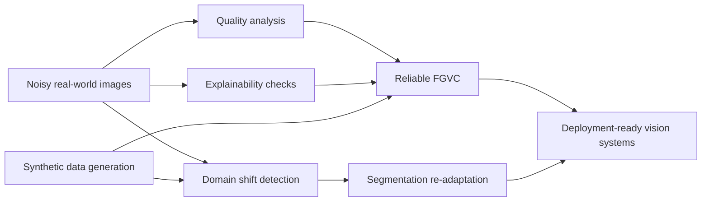

# Joseph Smith

<p align="center">
  
</p>

<p align="center">
  <a href="https://joesmithvision.com"></a>
  <a href="https://www.linkedin.com/in/joe-smith-08039b190/"></a>
  <a href="https://scholar.google.com/citations?user=hb_vGvoAAAAJ&hl=en"></a>
  <a href="mailto:j.smith57@newcastle.ac.uk"></a>
</p>

```text
Joseph.run()
├── role: Computer Vision Researcher / ML Engineer
├── focus: robust, explainable, deployment-aware deep learning
├── phd: Newcastle University (viva passed March 13, 2026)
├── publications: CVPR 2024, ECCV 2024, VISAPP 2024, Array 2025
├── award: Best Paper, ECCV VISION Workshop 2024
└── now: finishing corrections + looking for Research Scientist roles
```

## What makes my work different

I care less about models that only look good on clean benchmarks and more about systems that keep working when the images are compressed, blurred, shifted, or collected in the wrong lighting by the wrong device on the wrong day.

That has pushed my work toward:

- fine-grained visual classification under image quality variation
- explainability for debugging model behavior rather than decorating papers
- segmentation re-adaptation under domain shift
- synthetic data pipelines that improve real-world robustness
- anti-counterfeiting and industrial inspection where failure actually matters

## Selected work

| Project | Why it matters |
| --- | --- |
| **Robust and Explainable Fine-Grained Visual Classification with Transfer Learning** | Showed how explainability and transfer learning can make FGVC systems more trustworthy under real acquisition noise. |
| **An Augmentation-based Model Re-adaptation Framework for Robust Image Segmentation** | Built a practical update strategy for evolving data distributions; won **Best Paper** at ECCV VISION Workshop 2024. |
| **Mobile phone image-based framework for anti-copy pattern detection and classification** | Focused on practical mobile-image acquisition constraints in anti-counterfeiting workflows. |
| **How Quality Affects Deep Neural Networks in Fine-Grained Image Classification** | Quantified how image quality impacts fine-grained classifiers and when filtering improves reliability. |

## Research map



## Toolbox

<p>
  
  
  
  
  
  
  
  
  
</p>

## Current arc

```text
2024  -> CVPR + VISAPP publications
2024  -> ECCV workshop publication + Best Paper award
2025  -> Visiting Scientist at DLR working on synthetic-to-real drone detection
2025  -> Array paper on anti-copy pattern detection
2026  -> PhD viva passed, minor corrections in progress
2026+ -> Looking for Research Scientist work in robust vision and reliable ML
```

## If you're here from GitHub

- I build research code with deployment constraints in mind.
- I like problems where robustness matters more than leaderboard aesthetics.
- I write about the engineering lessons as well as the models.

<p align="center">
  <sub>To use this as your GitHub profile, copy it into the README of the <code>Smithy305/Smithy305</code> repository.</sub>
</p>
